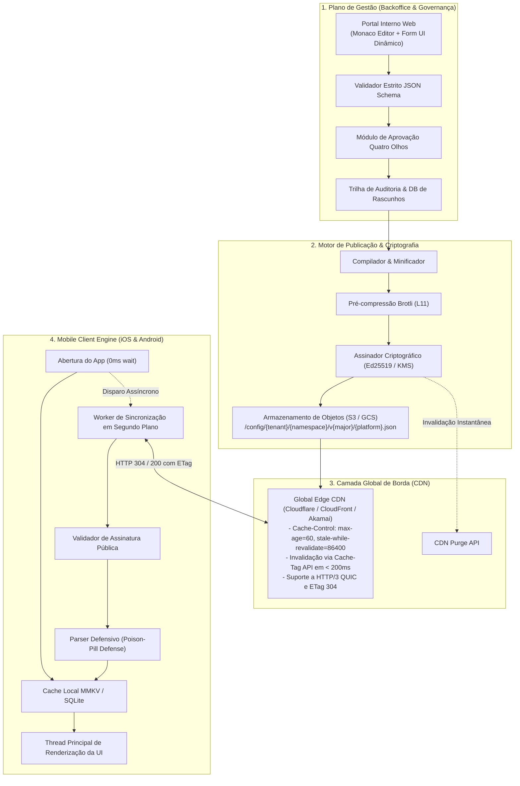

# RFC / Design Doc: Plataforma Proprietária de Remote Config & Dynamic Menus para App Bancário

**Status:** Aprovado para Planejamento  
**Data:** 12 de Setembro de 2026  
**Autores:** Equipe de Arquitetura & Engenharia de Alta Performance  
**Alvo:** Mobile Banking App (iOS / Android)  

---

## 1. Contexto e Motivação

Atualmente, o aplicativo móvel bancário utiliza o **Firebase Remote Config** para gerenciar tanto parâmetros operacionais simples (flags booleanas e valores numéricos) quanto estruturas de dados complexas e volumosas (árvores de navegação de menus, formulários e layouts da tela inicial). 

Com o crescimento contínuo da base de clientes e do tráfego simultâneo (especialmente em horários de pico, datas de pagamento e eventos sazonais), o Firebase Remote Config demonstrou limitações críticas:

1. **Payload Monolítico e Comprometimento de Latência:** O Firebase agrupa todas as configurações do projeto em um único dicionário. A inclusão de árvores JSON de menus (100KB+) junto a flags simples infla o download inicial (*cold start*), gerando desperdício de dados móveis e tempo de CPU no cliente.
2. **Ausência de Governança Estrita Bancária:** O console do Firebase não impõe validação formal de esquemas (*JSON Schema*). Um operador humano que inserir um campo com tipagem incompatível ou sintaxe malformada pode provocar *crashes* em cascata em milhões de dispositivos.
3. **Inexistência de Fluxo "Quatro Olhos" (*Maker-Checker*):** Em instituições financeiras, regulamentações exigem que alterações críticas em produção passem por aprovação formal e independente, com rastreabilidade total de auditoria.
4. **Vulnerabilidade a Thundering Herd e Rate Limits:** Em dias de pico massivo, requisições repetidas ao Firebase podem sofrer *throttling* ou atrasos imprevisíveis.

---

## 2. Objetivos e Não-Objetivos

### 2.1. Objetivos
* **Latência Sub-25ms na Borda:** 99%+ das requisições de checagem atendidas com resposta condicional rápida (`HTTP 304 Not Modified`).
* **Zero Latência no Cold Start (0ms na UI):** O app mobile nunca aguarda resposta de rede para renderizar a interface; a leitura é feita localmente em memória/disco local ultra-rápido (**MMKV**).
* **Blindagem de Governança e Contrato:** Todo payload é validado contra um catálogo formal de **JSON Schema** com rejeição de propriedades desconhecidas.
* **Fluxo Maker-Checker Obrigatório:** Separação estrita de perfis de quem cria e quem aprova alterações diárias, com visualização de *diff* e histórico de auditoria imutável.
* **Segurança Criptográfica de Nível Bancário:** Assinatura digital assimétrica (**Ed25519**) em todos os artefatos para impedir injeção ou adulteração de conteúdo (*Man-in-the-Middle*).
* **Resiliência a Desastres:** Servir a última configuração válida na CDN por até 7 dias mesmo em caso de falha catastrófica da infraestrutura interna de origem.

### 2.2. Não-Objetivos
* Não se trata de uma ferramenta de analytics ou telemetria de negócios (essas métricas continuam no pipeline de dados analíticos do banco).
* Não substitui bancos de dados transacionais dos produtos bancários (Pix, Saldo, Extrato possuem suas próprias APIs transacionais dedicadas).

---

## 3. Visão Geral da Arquitetura

A solução adota o padrão **Edge-Distributed Immutable Artifacts**:



---

## 4. Decomposição de Domínio & Modelo de Dados

Para eliminar o monólito do Firebase, a base de configurações é fatiada em **Namespaces Independentes**:

| Namespace | Finalidade | Tamanho Médio | Frequência de Atualização |
| :--- | :--- | :--- | :--- |
| `features.json` | Flags booleanas e limites numéricos | ~2KB - 5KB | Várias vezes ao dia |
| `navigation_menu.json` | Árvore de menus, ícones, deep links e visibilidade | ~30KB - 80KB | Semanal / Diária |
| `home_layout.json` | Carrosséis, atalhos rápidos e banners promocionais | ~15KB - 40KB | Várias vezes ao dia |

### 4.1. Estrutura de Particionamento Determinístico
Os artefatos compilados residem em caminhos determinísticos e imutáveis:
```text
/config/{tenant}/{ambiente}/{namespace}/v{app_major_version}/{plataforma}.json

Exemplos:
/config/retail/prod/navigation_menu/v3/android.json
/config/retail/prod/navigation_menu/v3/ios.json
/config/retail/prod/features/v3/common.json
```

### 4.2. Contrato JSON Schema (Exemplo: Menus de Navegação)
```json
{
  "$schema": "https://json-schema.org/draft/2020-12/schema",
  "title": "NavigationMenuConfig",
  "type": "object",
  "required": ["version", "items"],
  "additionalProperties": false,
  "properties": {
    "version": { "type": "integer", "minimum": 1 },
    "items": {
      "type": "array",
      "items": {
        "type": "object",
        "required": ["id", "title", "icon_name", "deep_link", "enabled"],
        "additionalProperties": false,
        "properties": {
          "id": { "type": "string", "pattern": "^[a-z0-9_]+$" },
          "title": { "type": "string", "minLength": 1, "maxLength": 50 },
          "icon_name": { "type": "string" },
          "deep_link": { "type": "string", "pattern": "^bank://[a-z0-9_/]+$" },
          "badge": { "type": ["string", "null"] },
          "enabled": { "type": "boolean" },
          "order": { "type": "integer" }
        }
      }
    }
  }
}
```

---

## 5. Plano de Gestão (Backoffice & Governança Maker-Checker)

### 5.1. Interface de Usuário Híbrida
* **Modo Formulário Assistido:** Analistas de negócios e produtos utilizam controles visuais (*toggles*, campos de texto validados, seletores) gerados automaticamente a partir do JSON Schema.
* **Modo Monaco Editor (Avançado):** Engenheiros dispõem de editor completo com realce de sintaxe, autocompletar e validação semântica com indicação visual de erros.
* **Simulador de Telas (*Live Preview*):** Ao editar a árvore de menu, um simulador visual de smartphone renderiza o resultado da tela em tempo real ao lado do editor.

### 5.2. Fluxo Maker-Checker (Quatro Olhos)
1. **Criação de Proposta (*Maker*):** O usuário altera os dados e clica em *"Solicitar Aprovação"*. O sistema registra a alteração no banco interno como `PENDING_APPROVAL`.
2. **Revisão e Diff Visual (*Checker*):** Um segundo usuário aprovador (com papel diferente de quem criou) visualiza um *diff* comparativo linha a linha entre a versão atual em produção e a versão proposta.
3. **Verificação de Impacto:** O painel emite alertas caso itens críticos (como opções de *Pix* ou *Cartões*) tenham sido desativados na proposta.
4. **Assinatura e Disparo:** Aprovada a proposta, o pipeline de compilação é acionado automaticamente.

### 5.3. Trilha de Auditoria e Rollback com 1 Clique
* **Histórico Imutável:** Todo evento armazena: Identificador do Solicitante, Identificador do Aprovador, Timestamp UTC, Justificativa/Ticket Jira, Hash SHA-256 da revisão e o payload integral antes e depois.
* **Rollback Instantâneo:** O painel mantém o histórico de revisões (`rev_1041`, `rev_1042`, `rev_1043`). O acionamento de rollback aponta o ponteiro de publicação de volta para a revisão anterior em menos de 5 segundos.

---

## 6. Stack Tecnológico do Backend & Pipeline de Publicação

O backend atua exclusivamente como **Plano de Controle (Gestão e Publicação)**. Ele não recebe tráfego direto dos aplicativos móveis (absorvido pela CDN), o que torna o ecossistema **Node.js (LTS v22) + TypeScript** a escolha ideal por produtividade, tipagem estrita e APIs nativas em C++ de alta performance.

### 6.1. Componentes do Backend Node.js
* **Framework Web:** **Fastify** — escolhido por ter `Ajv` integrado nativamente ao seu núcleo e oferecer throughput até 3x superior ao Express.
* **Validação de Schemas:** `ajv` (Another JSON Schema Validator) + `ajv-formats` — compilação de schemas para funções JIT altamente otimizadas na engine V8.
* **Banco de Dados Interno:** **PostgreSQL** com **Prisma** ou **Drizzle ORM** — garante propriedades ACID para rascunhos, histórico de aprovações (*Maker-Checker*) e trilha de auditoria imutável.
* **Criptografia Assimétrica:** Módulo nativo `node:crypto` — suporte C++/OpenSSL de alto desempenho para assinatura e geração de chaves **Ed25519**.
* **Compressão:** Módulo nativo `node:zlib` — suporte nativo ao algoritmo **Brotli** (`BROTLI_PARAM_QUALITY: 11`).
* **Armazenamento de Objetos:** `@aws-sdk/client-s3` — upload para AWS S3, Cloudflare R2 ou MinIO.

### 6.2. Pipeline Determinístico de Compilação & Publicação
Assim que a proposta recebe a aprovação do segundo operador (*Checker*), o serviço em Node.js executa o seguinte fluxo síncrono em menos de 300ms:

1. **Validação Estrita via Ajv:**
   ```typescript
   const isValid = ajvValidator(draftPayload);
   if (!isValid) throw new SchemaValidationError(ajvValidator.errors);
   ```
2. **Minificação e Conversão para Buffer:**
   ```typescript
   const minifiedJson = JSON.stringify(draftPayload);
   const payloadBuffer = Buffer.from(minifiedJson, 'utf-8');
   ```
3. **Assinatura Criptográfica Nativa (Ed25519):**
   ```typescript
   import crypto from 'node:crypto';
   
   const signature = crypto.sign(null, payloadBuffer, privateKeyPem).toString('base64');
   const finalEnvelope = JSON.stringify({
     revision: nextRevisionId,
     timestamp: new Date().toISOString(),
     signature,
     data: draftPayload
   });
   ```
4. **Pré-Compressão Brotli Máxima (Offline):**
   ```typescript
   import zlib from 'node:zlib';
   
   const brotliBuffer = zlib.brotliCompressSync(Buffer.from(finalEnvelope), {
     params: { [zlib.constants.BROTLI_PARAM_QUALITY]: 11 }
   });
   ```
5. **Upload Concorrente para S3 / Object Storage:**
   * Grava a revisão imutável: `/config/{namespace}/rev_{id}.json` e `.json.br`.
   * Atualiza o ponteiro de produção: `/config/{namespace}/latest.json` e `.json.br`.
6. **Invalidação Ativa na CDN (Purge API):**
   * Emissão da chamada HTTP para a CDN purgar a tag: `tenant-retail-{namespace}`.
   * Tempo total de propagação na borda: **< 2 segundos**.

---

## 7. Camada Global de Borda (Edge CDN & Resiliência)

### 7.1. Cabeçalhos HTTP de Alta Performance
```http
Cache-Control: public, max-age=60, stale-while-revalidate=86400, stale-if-error=604800
ETag: "sha256-hash-rev1043"
Vary: Accept-Encoding
Content-Encoding: br
```

* `max-age=60`: Mantém a resposta fresca no nó de borda por 60 segundos.
* `stale-while-revalidate=86400`: Permite que a CDN sirva a versão em memória instantaneamente enquanto valida em segundo plano com a origem.
* `stale-if-error=604800`: Em caso de pane catastrófica da nuvem de origem ou bucket S3, a CDN continua respondendo as configurações válidas por até 7 dias sem interrupção de serviço aos clientes.

### 7.2. Otimizações de Tráfego de Borda
* **Request Coalescing (Colapso de Requisições):** Se milhares de requisições concorrentes atingirem um nó da CDN logo após um *purge*, a borda consolida todas as requisições pendentes em uma única busca à origem, eliminando o risco de colapso por efeito manada (*thundering herd*).
* **HTTP/3 com QUIC:** Conexão otimizada sobre UDP que elimina o bloqueio de início de fila (*head-of-line blocking*), crucial para dispositivos móveis em redes celulares 4G/5G com variação de sinal.
* **Validação Condicional HTTP 304:** Quando o hash coincide com a versão já mantida no dispositivo, a CDN devolve um pacote de cabeçalhos sem corpo (< 300 bytes), economizando mais de 98% de banda.

---

## 8. Arquitetura do SDK Mobile (iOS & Android)

### 8.1. Estratégia de Inicialização (Cold Start em 0ms)
* O app **nunca** bloqueia a UI ou a tela de splash aguardando requisição de rede.
* O armazenamento local utiliza **MMKV** (motor de chave-valor de alta velocidade baseado em memória mapeada `mmap`).
* A leitura dos menus e parâmetros do disco local para a RAM ocorre em **menos de 2 milissegundos**.
* A interface renderiza imediatamente o estado armazenado localmente.

### 8.2. Sincronização em Segundo Plano
* Um worker assíncrono em segundo plano dispara a chamada HTTP/3 para a CDN enviando `If-None-Match: "etag_local"`.
* Se a resposta for **HTTP 304 (Not Modified)**: Nenhuma operação adicional é necessária.
* Se a resposta for **HTTP 200 (OK)** com novo payload:
  1. **Validação da Assinatura Ed25519:** O SDK utiliza a chave pública embutida no binário do aplicativo para validar a integridade. Se a assinatura falhar, o payload é sumariamente descartado e reportado para a telemetria.
  2. **Parsing Defensivo (*Poison-Pill Defense*):** Caso algum item do array contenha uma anomalia estrutural, o parser descarta pontualmente aquele item defeituoso e preserva todos os demais, impedindo que o app feche (*crash*).
  3. **Persistência no MMKV:** A nova versão é salva em disco.

### 8.3. Política de Aplicação Suave (*No Layout Shift*)
* **Flags Booleanas / Operacionais:** Atualizam imediatamente via fluxos de estado reativos (`StateFlow` no Android / `Combine` no iOS).
* **Estrutura de Menus e Telas:** Gravadas no cache local e marcadas como prontas; são aplicadas suavemente na próxima transição de tela ou na próxima sessão do usuário, evitando que botões mudem de posição sob a interação do correntista.

### 8.4. Configuração Padrão de Fábrica (*Embedded Fallback*)
* Toda versão distribuída nas lojas contém um arquivo `bundled_defaults.json` embutido nos assets do binário.
* Se um usuário abrir o aplicativo pela primeira vez sem conexão com a internet, o aplicativo opera normalmente com as configurações e menus de fábrica.

### 8.5. Observabilidade e Telemetria
Métricas coletadas via OpenTelemetry Mobile:
* `remote_config.cache_hit_ratio`: Proporção de respostas 304 vs 200.
* `remote_config.fetch_duration_ms`: Latência das checagens de borda.
* `remote_config.parse_error_count`: Alerta imediato sobre incompatibilidades de tipagem.
* `remote_config.active_revision_id`: Distribuição de versões ativas na base instalada.

---

## 9. Procedimento Operacional de Emergência (Kill-Switch)

Para cenários onde um recurso bancário precisa ser desativado imediatamente (ex.: fraude em curso ou instabilidade grave de um parceiro):
1. O operador altera a flag crítica no painel (ex.: `killswitch_pix_v2: true`).
2. O sistema executa o *purge* instantâneo na CDN.
3. Paralelamente, o serviço emite um sinal de **Silent Push Notification** (via Apple APNs e Firebase Cloud Messaging) para o tópico de emergência.
4. Os dispositivos que estiverem com o aplicativo ativo em primeiro plano recebem a notificação invisível, disparam a busca da nova configuração e desativam o recurso em poucos segundos.

---

## 10. Fases de Implementação Propostas

1. **Fase 1 (Contratos e Schemas):** Mapeamento e escrita dos schemas JSON (Menus, Features, Layout) e configuração do bucket S3 versionado.
2. **Fase 2 (Publisher & Borda CDN):** Implementação do serviço de assinatura Ed25519, pipeline de compressão Brotli e regras de cache na CDN.
3. **Fase 3 (SDK Mobile & Piloto):** Desenvolvimento do módulo de leitura com MMKV, parser defensivo e validação de assinatura no app, iniciando com o namespace de `features.json`.
4. **Fase 4 (Migração de Menus & Backoffice):** Entrega do painel administrativo com formulários guiados e fluxo Maker-Checker, migrando a árvore completa de menus para fora do Firebase.
